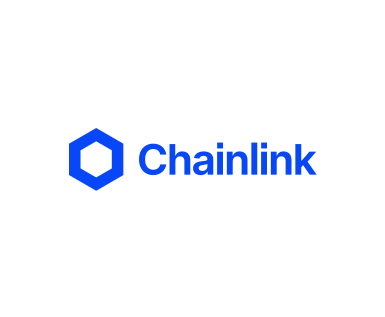
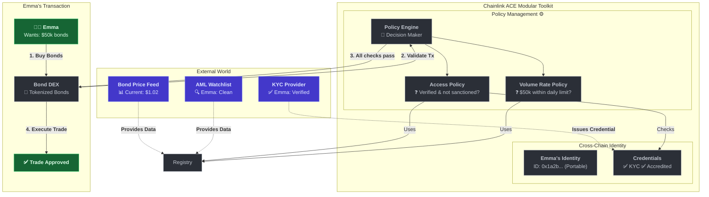

  

# Chainlink ACE Core Contracts

**Build the next generation of financial applications with programmable, cross‑chain compliance—powered by the Chainlink Automated Compliance Engine (ACE).**

## What Problems Does This Solve?

Building compliant applications on the blockchain requires handling:

- **Dynamic policy enforcement** that evolves with regulations—without redeploying your core application contracts
- **Identity verification** across chains, without fragmented credentials
- **Trusted external data** (KYC providers, sanctions lists, price feeds, Proof of Reserves, etc.) delivered onchain

## Your Modular Toolkit

| Component                | Description                                                                        |
| ------------------------ | ---------------------------------------------------------------------------------- |
| **Policy Management**    | Dynamic engine to create and enforce onchain rules.                                |
| **Cross-Chain Identity** | Portable identity system for EVM chains; attach credentials once, verify anywhere. |

## Key Features

- **Modular & Composable**: Use one component or all three. They're designed to work together seamlessly.
- **Future-Proof**: Adapt to new regulations by updating policies, not your core application logic.
- **Cross-Chain Ready**: Manage identity and compliance consistently across multiple EVM networks.
- **Privacy-Preserving by Design**: Keep sensitive user data offchain while verifying credentials onchain.
- **Ready-to-Use Policies**: Plug-and-play modules for common compliance scenarios like volume limits and authorization.
- **EVM Compatible**: Works with existing tooling and supports future innovations like ZK proofs.

## How It Works: A Real-World Example

Here's how these three components work together. Imagine **Emma** (an institutional investor) wants to buy **$50,000** of a **Tokenized Bond** on a DEX.

### The Compliance Journey: Step-by-Step

1.  **Transaction Initiated**: Emma submits her buy order on the DEX. Before executing, the DEX's smart contract calls the **Policy Engine** to validate the transaction.
2.  **Access Policy Executes**: The Policy Engine executes the `Access Policy`, which uses the **Cross-Chain Identity** component to verify Emma has the required credentials (`✅ KYC`, `✅ Accredited`).
    _Crucially, this same identity and credential would be valid even if Emma were using a different wallet address on a different EVM chain._
3.  **Volume Rate Policy Executes**: Next, the engine runs the `Volume Rate Policy`, which tracks Emma's trading volume over time and confirms the $50,000 trade is within her daily limit.
4.  **Transaction Approved**: With all policies passing, the Policy Engine allows the transaction to proceed. The DEX executes the trade, and Emma receives her tokenized bonds.
    _The power of this model is that if regulations change tomorrow, the DEX's owners could add a new policy (e.g., a 'Time-of-Day Policy') without having to redeploy or alter the main DEX contract._

If any policy check had failed, the **Policy Engine would have reverted the transaction directly**, preventing a non-compliant trade.

## 🚀 Ready to Build?

### Want to get your hands dirty immediately?

Build with confidence using our reference implementations as your foundation.

- **Study the reference implementation for each component:**
  - [Policy Management](./packages/policy-management/src)
  - [Cross-Chain Identity](./packages/cross-chain-identity/src)
- **See full integrations in the [example tokens](./packages/tokens)**

### Want to learn more first?

Understand the architecture and design before diving into implementation.

**→ Continue reading about the components below**

## Explore the Components

### 🛡️ [Policy Management](./packages/policy-management/)

Use this component to enforce onchain rules that can be updated without redeploying your core contracts.

- **Policy Engine**: Pluggable, composable policy enforcement.
- **Zero Downtime Updates**: Add, remove, or modify rules dynamically.
- **Ready-to-Use Policies**: AllowPolicy, VolumePolicy, OnlyOwnerPolicy, and more.

→ **[📋 Quick Guide](./packages/policy-management/README.md)** | **[🏗️ Reference Implementation](./packages/policy-management/src/)** | **[📚 Deep Dive Docs](./packages/policy-management/docs/)** | **[📋 Ready-to-Use Policies](./packages/policy-management/src/policies/README.md)**

### 🔗 [Cross-Chain Identity](./packages/cross-chain-identity/)

Use this component to link wallet addresses to a single identity and manage credentials like KYC/AML.

- **Cross-Chain ID (CCID)**: Single identifier linking addresses across multiple chains.
- **Credential Registry**: Manage credentials (e.g., KYC, AML) that are tied directly to a user's CCID.
- **Privacy-First**: Store sensitive data offchain, only hashes onchain.

→ **[📋 Quick Guide](./packages/cross-chain-identity/README.md)** | **[🏗️ Reference Implementation](./packages/cross-chain-identity/src/)** | **[📚 Deep Dive Docs](./packages/cross-chain-identity/docs/)**

### [Example Tokens](./packages/tokens/)

Explore our example token contracts to see how these components work together in a real application.

- **[ERC-20 Compliance Token](./packages/tokens/erc-20)** - A policy-protected ERC-20 implementation with advanced frozen token handling
- **[ERC-3643 Compliance Token](./packages/tokens/erc-3643)** - A compliant implementation of the ERC-3643 T-REX standard

> **📝 Important Note on Frozen Token Behavior:**  
> These two token implementations handle frozen tokens differently during burns and forced transfers:
>
> - **ERC-20**: Frozen tokens remain frozen during burns/force transfers. The `_checkFrozenBalance()` function ensures sufficient unfrozen tokens are available before operations proceed.
> - **ERC-3643**: Automatically unfreezes tokens as needed during burns/force transfers to complete the operation.
>
> Both approaches are valid design choices depending on your compliance requirements. Choose the implementation that best fits your use case.

## Contributing & Feedback

We welcome community **feedback, audits, and contributions**. If you have additional compliance requirements or ideas for new features, please feel free to propose expansions or new modules.
