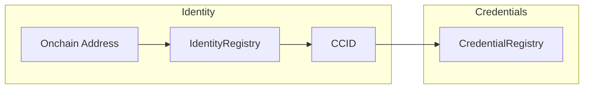
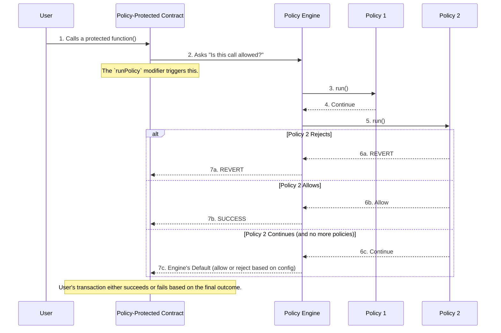
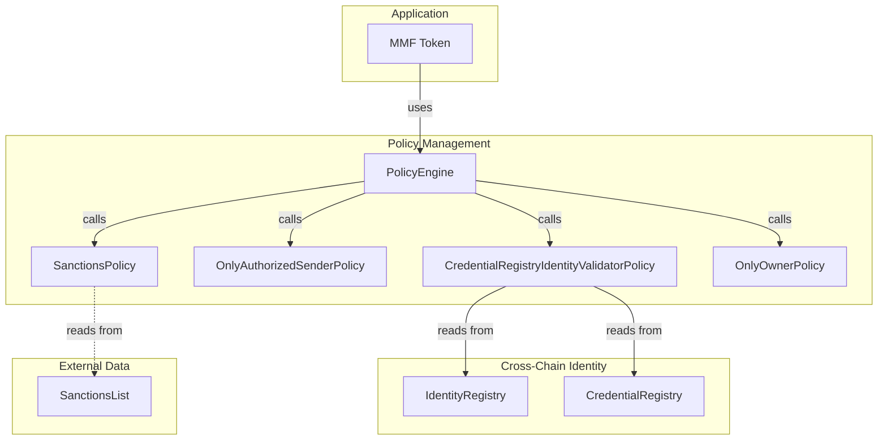

# Advanced Getting Started Guide

> **Prerequisites:** This guide builds on the [Getting Started Guide](../GETTING_STARTED.md), which teaches the core ACE integration pattern using Policy Management. **If you're new to ACE, start there first** to understand how `PolicyProtected`, `PolicyEngine`, and policies work together. This advanced guide adds Cross-Chain Identity for credential verification (KYC, sanctions, etc.).

## The Scenario: Lifecycle of a Tokenized Money Market Fund

In this guide, you'll take on distinct roles to deploy and interact with a complete, realistic compliance system for a **Tokenized Money Market Fund (MMF)**. This is a common real-world asset that requires robust compliance at every step.

By the end, you'll have learned how to use the core components of this toolkit to solve real-world problems.

**The Roles You'll Play:**

- **The Fund Manager:** The owner and administrator of the MMF contract. Your job is to mint the initial supply of shares, configure the compliance system, and distribute shares to verified investors.
- **The Sanctions Provider:** An independent entity that maintains their own sanctions list. You'll deploy and manage the list of sanctioned addresses.
- **The Credential Issuer:** A trusted, third-party entity responsible for performing offchain KYC checks and registering investors' identities and credentials onchain.
- **The Investors:** Alice and Charlie, who want to receive shares in the MMF.

**The Compliance Rules We'll Enforce:**

1.  Only the **Fund Manager** can mint new MMF shares.
2.  Shares can **only be transferred to investors who have passed KYC**.
3.  Shares **cannot be transferred to anyone on a sanctions list**.

This tutorial will show you how to enforce these rules dynamically using Cross-Chain Identity and Policy Management, without hard-coding them into the MMF contract itself.

## How the Components Work Together

Let's take 5 minutes to understand some fundamental concepts of this modular toolkit.

### 🔗 Cross-Chain Identity Infrastructure

A **Cross-Chain Identifier (CCID)** sits at the centre of the identity model.

- **CCID (`bytes32`)** – One identifier per user that is recognised across _all_ EVM chains.
- **`IdentityRegistry`** – Maps each onchain address to its CCID (`address → CCID`). A single CCID can have many addresses (e.g., the same user on Ethereum, Polygon, and a private chain).
- **`CredentialRegistry`** – Stores credentials keyed by CCID. Any address that resolves to that CCID automatically "inherits" the credential (e.g., KYC, AML).



**Learn more** → [CCID deep dive](../../packages/cross-chain-identity/docs/CONCEPTS.md#cross-chain-identifier-ccid)

_**Contracts Deployed in this Example:** `IdentityRegistry.sol`, `CredentialRegistry.sol`_

### 🛡️ Policy Management Infrastructure

A **Policy Engine** lets you compose multiple rules without touching the core contract code. The engine is connected to your application via a `PolicyProtected` contract.

- **`PolicyProtected` Contract**: Your application contract inherits from `PolicyProtected`. You then add the `runPolicy` modifier to any function you want to secure. This modifier is the "hook" that tells your contract to ask the `PolicyEngine` for permission before proceeding.
- **`PolicyEngine`**: Executes a chain of policies for any protected function. An administrator registers policies against a specific function signature (selector), creating a flexible ruleset.
- **Policies**: Self-contained contracts that hold a single rule (e.g., `OnlyOwnerPolicy`, `VolumePolicy`). Each returns `Allowed`, `Continue`, or reverts with a `PolicyRejected` error.
- **Extractors**: Helper contracts that parse transaction data for the policies.

The `PolicyEngine` executes policies **in the order they are added**. The first definitive result (`Allowed` return or `PolicyRejected` revert) decides the outcome. If all policies return `Continue`, the engine's pre-configured default behavior (allow or reject based on the boolean `defaultAllow` parameter) is applied. Therefore, policy ordering is critical.



**Learn more** → [Policy flow](../../packages/policy-management/docs/CONCEPTS.md#the-policy-flow-a-step-by-step-breakdown)

_**Contracts Deployed in this Example:** `PolicyEngine.sol`, `OnlyOwnerPolicy.sol`, `OnlyAuthorizedSenderPolicy.sol`, `CredentialRegistryIdentityValidatorPolicy.sol`, `SanctionsPolicy.sol`_

### Architecture of this Example

This diagram shows how the deployed contracts are wired together for our Tokenized Money Market Fund.



**The Magic**: These components work together automatically. When someone tries to transfer tokens, the system:

1.  **Identifies** who they are and checks their KYC status (**Cross-Chain Identity**).
2.  **Enforces** the rules and allows or blocks the transaction (**Policy Management**).

## Prerequisites

- [Node.js](https://nodejs.org/en/download/) (v18 or later)
- [Foundry](https://book.getfoundry.sh/getting-started/installation) (v0.3.0 or later)
- [pnpm](https://pnpm.io/installation)

## Setup

1. **Clone and enter the repository:**

   ```bash
   git clone https://github.com/smartcontractkit/chainlink-ace.git
   cd chainlink-ace
   ```

2. **Install dependencies:**

   ```bash
   pnpm install
   ```

3. **Build the project:**

   ```bash
   pnpm build
   ```

## Start anvil chain

From a new terminal, start a new anvil chain by running:

```bash
anvil
```

**Note:** Keep this terminal open - anvil runs on `http://localhost:8545` by default. Open a new terminal instance for the next steps.

## Building Your Compliance System

### Prerequisite: Setup your environment

For convenience, we've provided an example `.env` file that will simplify going through the rest of the guide.

1.  **Create a `.env` file:**
    Copy the example environment file to a new `.env` file in the root of the repository.

    ```bash
    cp getting_started/advanced/.env.example .env
    ```

    > **Note:** The addresses in the `.env.example` file are deterministic and should be correct if you are using a fresh Anvil instance. As a best practice, we'll double-check that the addresses in your `.env` file match the contract addresses logged in your terminal after running the deployment scripts in the next steps.

2.  **Load the environment variables:**
    Run the following command to export all the variables into your current terminal session. You'll need to do this for every new terminal you open.

    ```bash
    source .env
    ```

### Prerequisite: Deploy a Sanctions List as a Sanctions Provider

In a realistic scenario, a Sanctions Provider maintains its own sanctions list. They own the `SanctionsList` contract independently, and the Fund Manager's compliance system simply references it.

**As the Sanctions Provider**, deploy a [sanctions list](./SanctionsList.sol):

```bash
export ETH_RPC_URL=http://localhost:8545
PRIVATE_KEY=$SANCTIONS_PROVIDER_PRIVATE_KEY forge script script/getting_started/advanced/DeploySanctionsList.s.sol:DeploySanctionsList \
  --rpc-url $ETH_RPC_URL \
  --broadcast
```

**Expected output:** The script will log the deployed address:

```
SanctionsList deployed at: 0x...
```

> **Note:** If you're using a fresh Anvil instance, this address should match the `SANCTIONS_LIST_ADDRESS` in your `.env.example` file (deterministic deployment). If the addresses don't match, update your `.env` file with the actual deployed address and run `source .env` again.

The Fund Manager's deployment script will configure the `SanctionsPolicy` to point to this address.

### Deploy Your Compliance System

Now, let's build the Tokenized MMF. We'll use a [deployment script](../../script/getting_started/advanced/DeployAdvancedGettingStarted.s.sol) specifically created for this more comprehensive scenario.

This single command will deploy all the necessary contracts as the Fund Manager, including the MMF token, the Policy Engine, the registries, and all the required policies. The script will configure the system to use the Sanctions List deployed by the Sanctions Provider in the prerequisite step above.

```bash
PRIVATE_KEY=$FUND_MANAGER_PRIVATE_KEY forge script script/getting_started/advanced/DeployAdvancedGettingStarted.s.sol:DeployAdvancedGettingStarted \
  --rpc-url $ETH_RPC_URL \
  --broadcast
```

The script will output the deployed contract addresses at the **beginning** of the console logs. Verify that the addresses set in your `.env` file match the addresses logged in your terminal.

### Understanding Contract Ownership

After deployment, here's a summary of who controls what:

| Contract                | Owner                            | What This Means                                          |
| ----------------------- | -------------------------------- | -------------------------------------------------------- |
| **Policy Engine**       | Fund Manager                     | Controls which policies are attached to which functions  |
| **MMF Token**           | Fund Manager (via Policy Engine) | Token admin functions are protected by policies          |
| **Identity Registry**   | Fund Manager (via Policy Engine) | Registration requires authorized sender policy           |
| **Credential Registry** | Fund Manager (via Policy Engine) | Credential issuance requires authorized sender policy    |
| **Sanctions List**      | Sanctions Provider               | Independently deployed and managed by the provider       |
| **All Policies**        | Fund Manager                     | Can configure policy parameters (pause, authorize, etc.) |

**Delegated Access:**

- **Credential Issuer**: Authorized by Fund Manager to call registry functions (doesn't own contracts)

**Key Insight:** The Policy Engine architecture lets the Fund Manager control the _compliance framework_ (what rules exist) while delegating _operational duties_ (KYC checks, sanctions updates) to specialized actors.

## Testing the Compliance System: A Step-by-Step Walkthrough

Now, let's test the system by taking on our different roles.

### Step 1 (as Fund Manager): Mint Initial Shares

Only the `Fund Manager` (or an authorized minter) can create new shares. Let's mint 1,000,000 MMF shares to the manager's address.

```bash
cast send $TOKEN_ADDRESS "mint(address,uint256)" $FUND_MANAGER_ADDRESS 1000000000000000000000000 --private-key $FUND_MANAGER_PRIVATE_KEY
```

**Why this works:** The `mint` function is protected by an `OnlyAuthorizedSenderPolicy`. Our script authorizes the `Fund Manager` as a minter by default, so the Policy Engine allows the transaction.

**Let's verify the policy is enforcing:** Now try minting with an unauthorized address (Alice):

```bash
cast send $TOKEN_ADDRESS "mint(address,uint256)" $ALICE_ADDRESS 1000000000000000000000000 --private-key $ALICE_PRIVATE_KEY
```

**Expected:** `Error: PolicyRunRejected` with reason `"sender is not authorized"`

This demonstrates that the policy is actively protecting the `mint` function. Only authorized minters can create new shares.

### Step 2 (as Fund Manager): Authorize the Credential Issuer

The `IdentityRegistry` and `CredentialRegistry` are protected by the `identityOnlyAuthorizedSenderPolicy`. To allow our trusted issuer to register users, the `Fund Manager` must add the `CREDENTIAL_ISSUER_ADDRESS` to that policy's authorized list.

```bash
cast send $IDENTITY_ONLY_AUTHORIZED_POLICY_ADDRESS "authorizeSender(address)" $CREDENTIAL_ISSUER_ADDRESS --private-key $FUND_MANAGER_PRIVATE_KEY
```

### Step 3 (as Credential Issuer): Onboard Investors

Now that the Credential Issuer is authorized by the policy, it can call the registry contracts to onboard Alice and Charlie.

```bash
# Register Alice's Identity
cast send $IDENTITY_REGISTRY_ADDRESS "registerIdentity(bytes32,address,bytes)" $ALICE_CCID $ALICE_ADDRESS 0x --private-key $CREDENTIAL_ISSUER_PRIVATE_KEY

# Grant Alice KYC
cast send $CREDENTIAL_REGISTRY_ADDRESS "registerCredential(bytes32,bytes32,uint40,bytes,bytes)" $ALICE_CCID $KYC_CREDENTIAL 0 0x 0x --private-key $CREDENTIAL_ISSUER_PRIVATE_KEY

# Register Charlie's Identity
cast send $IDENTITY_REGISTRY_ADDRESS "registerIdentity(bytes32,address,bytes)" $CHARLIE_CCID $CHARLIE_ADDRESS 0x --private-key $CREDENTIAL_ISSUER_PRIVATE_KEY

# Grant Charlie KYC
cast send $CREDENTIAL_REGISTRY_ADDRESS "registerCredential(bytes32,bytes32,uint40,bytes,bytes)" $CHARLIE_CCID $KYC_CREDENTIAL 0 0x 0x --private-key $CREDENTIAL_ISSUER_PRIVATE_KEY
```

**Why this works:** The transactions succeed because they are sent from an address (`CREDENTIAL_ISSUER_ADDRESS`) that we explicitly authorized in the `identityOnlyAuthorizedSenderPolicy` in the previous step.

### Step 4 (as Sanctions Provider): Update Sanctions Data

As the owner of the `SanctionsList` contract, you can now add Charlie's address to the sanctions list.

```bash
cast send $SANCTIONS_LIST_ADDRESS "add(address)" $CHARLIE_ADDRESS --private-key $SANCTIONS_PROVIDER_PRIVATE_KEY
```

### Step 5 (as Fund Manager): Distribute Shares

Now that the system is fully configured, **as the Fund Manager**, let's attempt to distribute shares to our investors.

**A. Transfer to Alice (Should Succeed)**

The Fund Manager sends 100 shares to Alice (100 shares = 100 \* 10^18 MMF tokens):

```bash
cast send $TOKEN_ADDRESS "transfer(address,uint256)" $ALICE_ADDRESS 100000000000000000000 --private-key $FUND_MANAGER_PRIVATE_KEY
```

You can confirm the transfer was successful by checking Alice's balance:

```bash
cast call $TOKEN_ADDRESS "balanceOf(address)" $ALICE_ADDRESS | cast --from-wei
```

This should return `100`.

**Expected Result:** ✅ **SUCCESS!** The `PolicyEngine` checks the policies for the `transfer` function:

1.  The `CredentialRegistryIdentityValidatorPolicy` confirms Alice has a `KYC` credential. It returns `Continue`.
2.  The `SanctionsPolicy` checks its configured `SanctionsList` and confirms Alice is **not** on it. It also returns `Continue`.

Since no policy reverted with a `PolicyRejected` error, the engine applies its default result, which was configured to allow by default (`true`). The transaction is approved.

**B. Transfer to Charlie (Should Fail)**

Now the Fund Manager attempts to send 100 shares to Charlie:

```bash
cast send $TOKEN_ADDRESS "transfer(address,uint256)" $CHARLIE_ADDRESS 100000000000000000000 --private-key $FUND_MANAGER_PRIVATE_KEY
```

**Expected Result:** ❌ **REVERT!** The transaction is blocked with `Error: PolicyRunRejected` and reason `"account sanctions validation failed"`.

1.  The `CredentialRegistryIdentityValidatorPolicy` confirms Charlie has a `KYC` credential. It returns `Continue`.
2.  The `SanctionsPolicy` checks its configured `SanctionsList` and sees that Charlie's address **is** on the list. It reverts with a `PolicyRejected` error, and the `PolicyEngine` immediately reverts the entire transaction with `PolicyRunRejected`.

**C. Investor-to-Investor Transfer to Charlie (Should Also Fail)**

Let's verify that the sanctions policy works regardless of who is sending. Alice will now attempt to send 50 shares to Charlie:

```bash
cast send $TOKEN_ADDRESS "transfer(address,uint256)" $CHARLIE_ADDRESS 50000000000000000000 --private-key $ALICE_PRIVATE_KEY
```

**Expected Result:** ❌ **REVERT!** The transaction is blocked with `Error: PolicyRunRejected` and reason `"account sanctions validation failed"`.

The same flow occurs: the KYC check passes, but the sanctions check fails. This demonstrates that **Charlie cannot receive tokens from anyone**—neither the Fund Manager nor other investors—because the sanctions policy evaluates the recipient address, not the sender.

### Anatomy of a Compliance Check: How the Transfer to Charlie Was Blocked

The previous steps worked because of how we wired the components together in the deployment script. Let's break down exactly what happened behind the scenes during the failed transfer to Charlie, from setup to execution.

#### The Setup (from [`DeployAdvancedGettingStarted.s.sol`](../../script/getting_started/advanced/DeployAdvancedGettingStarted.s.sol))

Three critical connections were made when you ran the deployment script:

1.  **`setExtractor`**: We told the `PolicyEngine` that for any call to the `transfer` function, it must use the `ERC20TransferExtractor`. This extractor's job is to read the raw transaction calldata and pull out the `to` address parameter.
2.  **`addPolicy`**: We added two policies to the `transfer` function's execution chain: first the `CredentialRegistryIdentityValidatorPolicy`, then the `SanctionsPolicy`. We also told the engine that both policies require the `to` parameter, which the extractor provides.
3.  **`setSanctionsList`**: We told the `SanctionsPolicy` the direct address of the `SanctionsList` contract, linking the rule to its data.

These three steps set the stage for the dynamic, real-time compliance check.

#### The Live Flow: Alice transfers to Charlie

Here is the step-by-step journey of the transaction as it moves through the system:

1.  **The Call Starts**: Your wallet calls `mmfToken.transfer(CHARLIE_ADDRESS, 100)`.
2.  **`PolicyProtected` Intercepts**: The `runPolicy` modifier on the `transfer` function immediately halts execution and passes the entire transaction payload to the `PolicyEngine`, asking, "Is this allowed?"
3.  **Engine Consults Extractor**: The `PolicyEngine` sees the call is for the `transfer` selector (`0xa9059cbb`). It looks up which extractor to use and finds our [`ERC20TransferExtractor`](../../packages/policy-management/src/extractors/ERC20TransferExtractor.sol). It invokes the extractor, which parses the `calldata` and returns an array of named parameters—in this case, `(name: "from", value: SENDER_ADDRESS)`, `(name: "to", value: CHARLIE_ADDRESS)`, and `(name: "amount", value: 100)`. This makes all aspects of the transfer available for any policy to scrutinize.
4.  **Engine Runs Policy #1 (`CredentialRegistryIdentityValidatorPolicy`)**:
    - The engine sees this is the first policy in the chain for `transfer` and that it requires the `to` parameter.
    - It provides `CHARLIE_ADDRESS` to the policy's `run()` function.
    - The policy checks the `IdentityRegistry` and `CredentialRegistry`, finds that Charlie has the required `KYC` credential, and returns `Continue`. The engine proceeds to the next policy.
5.  **Engine Runs Policy #2 (`SanctionsPolicy`)**:
    - The engine moves to the second policy and sees it _also_ requires the `to` parameter.
    - It again provides `CHARLIE_ADDRESS` to the `SanctionsPolicy`'s `run()` function.
6.  **`SanctionsPolicy` makes its decision**:
    - The policy knows the address of the `SanctionsList` contract.
    - It calls `SanctionsList.isSanctioned(CHARLIE_ADDRESS)`.
    - The `SanctionsList` contract checks its internal mapping and returns `true`.
7.  **The Final Verdict**:
    - The `SanctionsPolicy` sees the result is `true` and immediately reverts with `IPolicyEngine.PolicyRejected("account sanctions validation failed")`.
8.  **Engine Halts and Reverts**:
    - The `PolicyEngine` catches the `PolicyRejected` error, wraps it in a `PolicyRunRejected` error with additional context (function selector, policy address, and reason), and reverts the entire transaction. Alice's transfer to Charlie fails.

This flow perfectly demonstrates the decoupling of the system: the `mmfToken` contract has no knowledge of sanctions.

This architectural separation is the key to the system's adaptability. If regulations change tomorrow, the compliance rules can be upgraded without ever touching or redeploying the core `mmfToken` contract. A new sanctions list could be configured, or a new policy requiring a different credential could be added to the `PolicyEngine`'s chain for the `transfer` function—all through governance transactions, providing a truly future-proof design.

## 🎉 You've Built It. Now What?

Congratulations! You've successfully deployed a complete, modular compliance system and seen how the components work together to enforce onchain rules automatically.

The best way to understand how all the components were connected is to review the script you just ran:

- → **[Study the deployment script](../../script/getting_started/advanced/DeployAdvancedGettingStarted.s.sol)**

From there, your next step depends on your goal:

- **"I want to build my own token"**

  - → Use the code in the [**`tokens` package**](../../packages/tokens) and [**`script` directory**](../../script) as templates for your own project.

- **"I want to understand a specific component better"**

  - → [**Explore the Components**](../../README.md#explore-the-components) in the main README to dive into the documentation for each part of the toolkit.

- **"I want to see more code examples"**
  - → Study the reference implementations in each component's `/src` folder.
  - → Review the usage patterns in the `/test` folders for advanced examples.
  - → Browse the [**ready-to-use policies**](../../packages/policy-management/src/policies/README.md) for plug-and-play modules.
