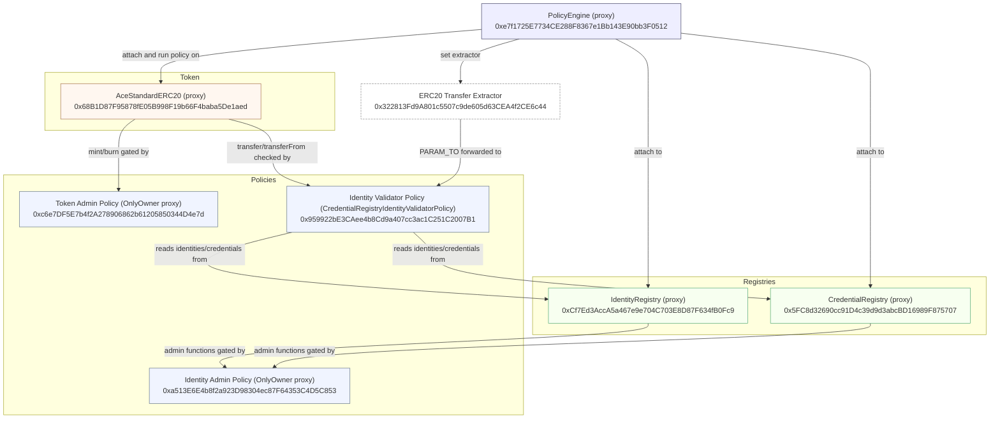

```mermaid
flowchart TD
  %% ===== Top orchestrator =====
  PolicyEngine["PolicyEngine (proxy)\n0xe7f1725E7734CE288F8367e1Bb143E90bb3F0512"]

  %% ===== Grouping by domain =====
  subgraph Registries
    IdentityRegistry["IdentityRegistry (proxy)\n0xCf7Ed3AccA5a467e9e704C703E8D87F634fB0Fc9"]
    CredentialRegistry["CredentialRegistry (proxy)\n0x5FC8d32690cc91D4c39d9d3abcBD16989F875707"]
  end

  subgraph Token
    AceToken["AceStandardERC20 (proxy)\n0x68B1D87F95878fE05B998F19b66F4baba5De1aed"]
  end

  subgraph Policies
    IdentityAdminPolicy["Identity Admin Policy (OnlyOwner proxy)\n0xa513E6E4b8f2a923D98304ec87F64353C4D5C853"]
    TokenAdminPolicy["Token Admin Policy (OnlyOwner proxy)\n0xc6e7DF5E7b4f2A278906862b61205850344D4e7d"]
    IdentityValidatorPolicy["Identity Validator Policy (CredentialRegistryIdentityValidatorPolicy)\n0x959922bE3CAee4b8Cd9a407cc3ac1C251C2007B1"]
  end

  ERC20Extractor["ERC20 Transfer Extractor\n0x322813Fd9A801c5507c9de605d63CEA4f2CE6c44"]

  %% ===== Attachments / hooks =====
  PolicyEngine -->|attach to| IdentityRegistry
  PolicyEngine -->|attach to| CredentialRegistry
  PolicyEngine -->|attach and run policy on| AceToken

  %% ===== Admin gating =====
  IdentityRegistry -->|admin functions gated by| IdentityAdminPolicy
  CredentialRegistry -->|admin functions gated by| IdentityAdminPolicy

  %% ===== Token checks =====
  AceToken -->|mint/burn gated by| TokenAdminPolicy
  AceToken -->|transfer/transferFrom checked by| IdentityValidatorPolicy

  %% ===== Validator reads from registries =====
  IdentityValidatorPolicy -->|reads identities/credentials from| IdentityRegistry
  IdentityValidatorPolicy -->|reads identities/credentials from| CredentialRegistry

  %% ===== Extractor plumbing =====
  PolicyEngine -->|set extractor| ERC20Extractor
  ERC20Extractor -->|PARAM_TO forwarded to| IdentityValidatorPolicy

  %% ===== Optional styling =====
  classDef engine fill:#eef,stroke:#446,stroke-width:1px;
  classDef reg fill:#f7fff0,stroke:#5a7,stroke-width:1px;
  classDef token fill:#fff7f0,stroke:#a75,stroke-width:1px;
  classDef policy fill:#f0f4ff,stroke:#678,stroke-width:1px;
  classDef extractor fill:#fff,stroke:#888,stroke-dasharray: 4 2;

  class PolicyEngine engine;
  class IdentityRegistry,CredentialRegistry reg;
  class AceToken token;
  class IdentityAdminPolicy,TokenAdminPolicy,IdentityValidatorPolicy policy;
  class ERC20Extractor extractor;
``` 