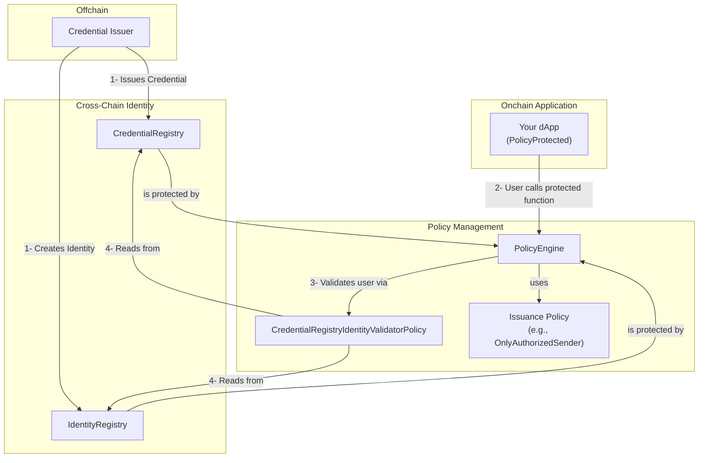

> **Prerequisite: Understanding Policy Management**
>
> This component is designed to be securely governed by the **[Policy Management](../policy-management/README.md)** component. The following examples and guides assume you have a basic understanding of how the `PolicyEngine` and policies work. We recommend reviewing the Policy Management documentation first.

# Cross-Chain Identity

**A unified identity and credential management system for all EVM-compatible blockchains, secured by the Policy Management component.**

Cross-Chain Identity provides a **single identity system** that works across all EVM chains. Using Cross-Chain Identifiers (**CCID**s) as unique identity anchors, you can **attach credentials** like
KYC, AML, or custom verifications **to each CCID** once and verify them everywhere—no more maintaining separate identity systems on each chain.

## Why This Matters

Managing user identity and compliance credentials (like KYC/AML) across multiple blockchains is a major challenge. Without a unified system, a user's identity is tied to a single address, forcing them to re-verify for every new address and on every new chain. This is expensive, inefficient, and a terrible user experience.

```solidity
// ❌ Before: A fragmented, per-address system. A user's KYC is tied
// to one address and doesn't apply to their other addresses.
contract FragmentedDApp {
    mapping(address => bool) public isKycVerified;

    function sensitiveAction() public {
        // This fails if the user calls from a different, un-verified address,
        // even if they are the same person who completed KYC.
        require(isKycVerified[msg.sender], "User not verified");
        // ...
    }
}

// ✅ After: A unified, identity-centric system. A user's credential is
// attached to their universal identity (CCID), not just one address. Any of
// their linked addresses can be used to pass a compliance check.
import { PolicyProtected } from "@chainlink/policy-management/core/PolicyProtected.sol";

contract UnifiedDApp is PolicyProtected {
    function sensitiveAction() public runPolicy {
        // The attached CredentialRegistryIdentityValidatorPolicy checks the credential
        // associated with the msg.sender's underlying CCID.
        // ...
    }
}
```

The Cross-Chain Identity component solves this with a universal **Cross-Chain Identifier (CCID)**. By attaching a credential to a user's single, persistent identity instead of a single address, that credential becomes portable and reusable across all their addresses and all EVM chains. A user verifies once and is recognized everywhere.

When this system is governed by the Policy Management component, it becomes not just portable, but also dynamically upgradeable, allowing you to change your credential requirements on the fly.

## How It Works: An Overview

Cross-Chain Identity is built on two core pillars:

1.  **[Cross-Chain Identifier (CCID)](docs/CONCEPTS.md#1-cross-chain-identifier-ccid)**: A unique `bytes32` identifier that links a user's various blockchain addresses (EVM) into a single, universal identity.
2.  **[Credential Management](docs/CONCEPTS.md#2-credential-management)**: A standardized framework to issue, manage, and verify credentials (like KYC/AML) associated with a CCID. By attaching credentials to a CCID instead of a wallet address, they become portable across all chains.

These concepts are implemented through a few key onchain contracts and offchain actors.

### Core Identity Components

- **`IdentityRegistry` & `CredentialRegistry`**: These two contracts are the heart of the system. The first maps user addresses to their universal CCID, and the second stores the credentials (like KYC status) associated with that CCID.
- **Credential Issuer (Offchain Actor)**: This is a trusted entity (e.g., your KYC provider) that performs real-world verification. It has the onchain permission to create new identities in the `IdentityRegistry` and/or issue credentials to them in the `CredentialRegistry`.
- **`CredentialRegistryIdentityValidatorPolicy`**: This is a specialized, pre-built policy that contains all the logic for checking credentials. You attach this to your application's functions to enforce your compliance rules.

### The Governance Layer (Policy Management)

The entire identity system is designed to be securely governed by the [Policy Management component](../policy-management/README.md).

- **Protecting the Registries**: The administrative functions on the `IdentityRegistry` and `CredentialRegistry` are protected by a `PolicyEngine`. This ensures that no unauthorized changes can be made.
- **Authorizing Issuers**: Instead of hardcoding who can manage the registries, you use a policy (like `OnlyAuthorizedSenderPolicy`) to grant a specific `Credential Issuer` the permission to call administrative functions on the `IdentityRegistry` and/or the `CredentialRegistry`.

This two-layered approach provides a powerful separation of concerns: the identity components manage the data, and the policy components manage the permissions.

This diagram illustrates how the components work together in the recommended, integrated pattern.



**Key Benefits**:

- **Cross-Chain Consistency**: Verify credentials issued on any EVM chain.
- **Secure by Design**: All administrative actions on the identity registries are governed by onchain policies.
- **Role Separation**: Clearly separates the role of the credential issuer from the application owner.
- **Dynamic & Upgradeable**: Update your verification requirements (e.g., require a new credential) or change your list of trusted issuers simply by updating a policy in the engine, with no changes to your core application.
- **Privacy Preserving**: Private information stays offchain, only verification results are onchain.

## How to Use

Using the Cross-Chain Identity component in a secure, integrated way involves three main steps, which are typically performed in a deployment script:

1.  **Deploy and Secure Infrastructure**: Deploy the `IdentityRegistry` and `CredentialRegistry`, making sure to set their owner to your `PolicyEngine` instance.
2.  **Configure Validation**: Deploy and configure the `CredentialRegistryIdentityValidatorPolicy` with your desired credential requirements (e.g., must have KYC). Then, use the `PolicyEngine` to attach this policy to the application functions you want to protect.
3.  **Authorize Issuers**: Deploy an access control policy (like `OnlyAuthorizedSenderPolicy`) to grant a trusted off-chain entity the permission to issue new credentials.

This setup creates a robust system where credential issuance and validation are both governed by flexible, onchain policies.

→ **For a complete, step-by-step code walkthrough, see the [API Guide](./docs/API_GUIDE.md).**

## Critical Requirements

### Non-Reverting View Functions

**All view functions in Cross-Chain Identity interfaces MUST NOT revert under any circumstances.** This is a critical requirement for reliable system operation.

Specifically, the following functions must be implemented with defensive programming patterns:

- `IIdentityValidator.validate()`
- `ICredentialDataValidator.validateCredentialData()`
- `ICredentialRegistryValidator.validate()` and `validateAll()`

Implementations should use try-catch blocks around external calls and return appropriate boolean results rather than allowing reverts to propagate. This ensures that credential validation failures in one source don't block the entire validation process.

## Next Steps

- **[Core Concepts](./docs/CONCEPTS.md)**: A deep dive into the architecture and design rationale.
- **[Credential Flow](./docs/CREDENTIAL_FLOW.md)**: A detailed sequence diagram of the entire verification process.
- **[API Guide](./docs/API_GUIDE.md)**: A developer-focused guide for common tasks.
- **[API Reference](./docs/API_REFERENCE.md)**: Complete interface specifications.
- **[Security Considerations](./docs/SECURITY.md)**: A checklist of key principles for a secure implementation.
- **[Implementation](./src/) & [Tests](./test/)**: Examine the reference implementation in `/src` and see it in action in the `/test` folder.
