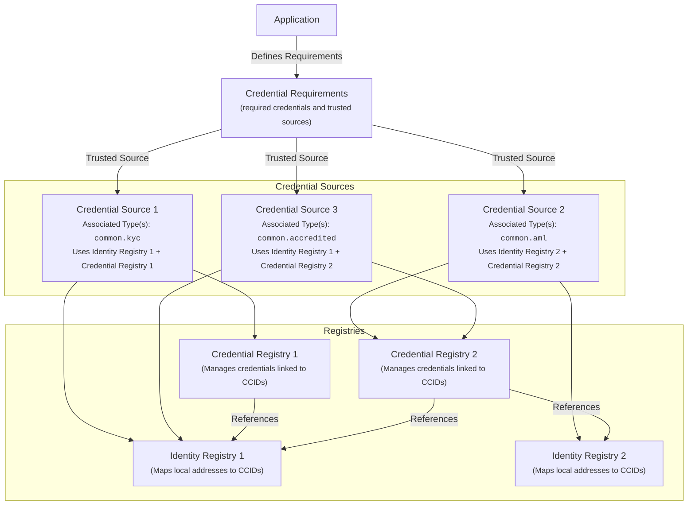
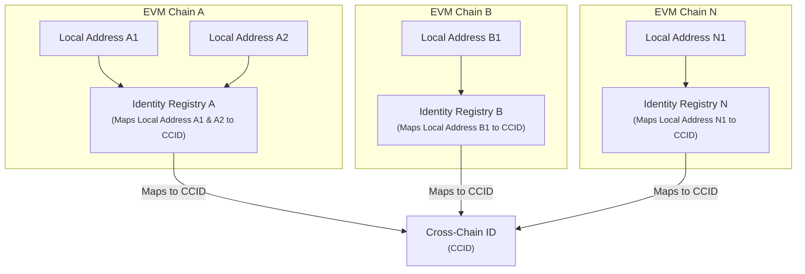

# Cross-Chain Identity Concepts

## Abstract

The Cross-Chain Identity component provides a unified interface for managing cross-chain identity and verifiable credentials through interoperable smart contracts. It introduces the **Cross-Chain Identifier (CCID)**, a 32-byte identifier that anchors an identity across EVM-compatible blockchains, enabling credential issuance, verification, and revocation while preserving the distinct security properties of each chain.

By supporting both self-sovereign identity principles and delegated verification, this component accommodates a range of trust models and fosters broad interoperability. This approach reduces fragmentation by offering a single, chain-agnostic identity framework.

## Glossary of Key Terms

| Term                   | Role                                                                                                                                                    |
| ---------------------- | ------------------------------------------------------------------------------------------------------------------------------------------------------- |
| **Credential Issuer**  | An **offchain** entity (e.g., a KYC provider) trusted to verify real-world information and write the results (credentials) onchain.                     |
| **Identity Validator** | An **onchain** contract that your dApp calls to check if a user meets a set of credential requirements.                                                 |
| **Credential Source**  | An **onchain** data structure that tells the Identity Validator which `IdentityRegistry` and `CredentialRegistry` to trust for a given credential type. |
| **CCID**               | A **`bytes32` identifier** that represents a single, universal identity for a user across all their addresses and all EVM chains.                       |

## Why Cross-Chain Identity?

As the blockchain ecosystem grows, users often juggle multiple identities spread across various networks. Verifying credentials issued on one chain from another chain becomes cumbersome without complex bridging solutions. This fragmentation:

- **Increases attack surface** - Multiple identity systems mean multiple points of failure
- **Hampers cross-chain governance** - Applications can't easily verify users across chains
- **Reduces interoperability** - Each chain requires separate identity verification
- **Duplicates implementation work** - Developers rebuild identity systems per chain

By introducing a unified approach to identity and credential management, this component:

- Streamlines verification of identity claims across chains
- Reduces duplicated implementation work
- Bolsters security and privacy for decentralized applications
- Enables seamless multi-chain governance and access control

## Core Architecture

The Cross-Chain Identity component addresses two fundamental elements:

### 1. Cross-Chain Identifier (CCID)

A 32-byte identifier that ties one or more local blockchain addresses across blockchain networks to a single identity.

### 2. Credential Management

A uniform framework for issuing, validating, and managing credentials (e.g., KYC, AML, or custom types). By linking credentials to a CCID instead of individual addresses, the system makes cross-chain identity verification seamless.

## System Components



### Key Components

- **Identity Registry**: Maintains mappings between local addresses and CCIDs. Each local address maps to exactly one CCID, though a single CCID can appear on multiple chains or with multiple addresses.

- **Credential Registry**: Manages the lifecycle of credentials linked to a CCID, including registration, removal, and renewal processes.

- **Credential Requirements**: An _optional_ registry for applications to define which credentials (e.g., "KYC" or "AML") they need, and from which trusted registries. It may also specify extra data validation steps.

- **Credential Sources**: Trusted sources that map specific Credential Type Identifiers to an **Identity Registry**, **Credential Registry**, and (optionally) a **Credential Data Validator**. A single source can handle multiple credential types.

- **Credential Issuer**: An offchain entity (e.g., service providers) authorized to conduct external checks (such as document verification, w3c credential validation, vLEI validation) and register the resulting credentials onchain.

- **Identity Validator**: A smart contract that lets applications validate accounts by leveraging the registries and validators.

For a visual representation of how these components interact, see the [Credential Issuance and Validation Flow](./CREDENTIAL_FLOW.md).

## Key Concepts

### Cross-Chain Identifier (CCID)

A **CCID** is a `bytes32` value representing a user's identity within the application domain and which can be used across multiple blockchains. Each chain maintains a local mapping between addresses (`address`) and a CCID, and one CCID can be referenced by multiple local addresses.

#### CCID Architecture



#### Generation and Uniqueness

- CCIDs are generated offchain (randomly or deterministically) and then registered onchain
- The component does not prescribe a specific creation method, only that any chosen approach MUST ensure uniqueness or collision resistance within the application domain
- A universal globally unique identifier is outside the scope of this package

#### Privacy and Correlation Considerations

This design allows a CCID to be associated to multiple blockchain addresses, including addresses on different blockchains. This design choice aids in identity verification across multiple blockchains and for actors that openly utilize multiple addresses on a single or even multiple blockchains.

When adopting or implementing this component, applications should consider the correlation effects, and take appropriate measures with regard to privacy, such as issuing multiple CCIDs per actor onchain while maintaining the correlation between CCIDs in offchain systems.

For a deeper dive on this topic, see the **[CCID Correlation and Anonymity](./SECURITY.md#5-ccid-correlation-and-anonymity)** section of the Security Guide.

### Credential Type Identifier

A **Credential Type Identifier** is a `bytes32` value denoting the type of credential in use (e.g., KYC, AML, Accredited Investor). While the component defines a set of common identifiers, implementations are free to create custom types.

#### Naming Scheme

Implementations MUST generate Credential Type Identifiers using a collision-resistant hash algorithm which outputs a `bytes32` value, where the pre-image is a human-readable namespaced string representing the requirement:

```solidity
keccak256("namespace.requirement_name")
```

Examples:

```solidity
// Common KYC credential
keccak256("common.kyc")

// Custom application-specific credential
keccak256("com.app.level.gold")
```

#### Common vs. Custom

- **Common credential types** are prefixed with `common.` (e.g., `common.kyc`, `common.aml`)
- **Custom credentials** MUST NOT use the `common.` prefix - this reserved namespace ensures future extensions can safely expand `common.` credential definitions without conflicts

#### Common Credentials

| Identifier          | Purpose                                     |
| ------------------- | ------------------------------------------- |
| `common.kyc`        | Identity has passed KYC checks              |
| `common.kyb`        | Identity has passed KYB checks              |
| `common.aml`        | Identity is not flagged by AML requirements |
| `common.accredited` | Identity is a qualified accredited investor |

### Credential Data

A credential in the **Credential Registry** can optionally include associated `bytes` of data. Depending on the use case, this data may be minimal (e.g., an offchain reference or a hashed proof) or more descriptive.

#### Privacy Considerations

Because many credential formats contain **personally identifiable information (PII)**, the component strongly encourages storing sensitive information offchain. The onchain credential data SHOULD be a pointer or a hash of the actual data, thus preserving user privacy.

#### Data Validation

The Credential Requirements contract can accept a **Credential Data Validator** contract when applications define requirements and, if present, MUST use it to validate the credential data (e.g., validating data structures).

**Important Security Note**: Data associated with a credential should be carefully considered and appropriately hashed. Without proper care, it could be possible to infer information, such as onchain credential expirations correlated to offchain credential expirations, such as on national IDs, passports, etc. Additionally, insufficiently hashed data could be susceptible to brute force information leaks.

### Credential Issuance and Validation Model

The system involves several key actors:

1. **Credential Issuer**

   - An offchain entity that performs real-world identity verification, generates a CCID for the subject, and posts the credential(s), possibly containing PII-redacted credential(s) in the onchain registries

2. **Identity and Credential Registry**

   - The Identity and Credential Registries are onchain registry contracts that maintain the identity of users, along with the verified credentials. These contracts can be used by onchain applications to verify the identity and inspect the list of issued credentials, and any associated data, of users

3. **Identity Validator**
   - The Identity Validator is an onchain utility contract that allows an application to specify one or more sources of identity/credential registries, along with all the required credentials in order to be considered a valid user. The Identity Validator can additionally use the data associated with a credential to determine the validity of the credential. Using the Identity Validator, an application can perform identity checks based solely on the caller's address and need not be aware of the CCID concept nor the credential type identifiers.

For a visual representation of how these components interact, see the [Credential Issuance and Validation Flow](./CREDENTIAL_FLOW.md).

### Credential Flow

A typical **credential lifecycle** includes an offchain **Credential Issuer** that issues a credential about a **User** into the onchain **Registries**:

1. **Request**: The **User** initiates a credential request with a Credential Issuer (e.g., for KYC compliance)
2. **Issuance**: The **Credential Issuer** conducts offchain checks and, if successful, registers the resulting credential onchain under the user's CCID. This onchain action is authorized by a policy in the `PolicyEngine`.
3. **Validation**: Applications enforce compliance by protecting their functions with the `CredentialRegistryIdentityValidatorPolicy`. When a user calls a protected function, the policy automatically checks if they possess the required credentials.

### Context Parameter Usage

Throughout the component, many functions accept a `bytes context` parameter. This field acts as a flexible mechanism for passing additional data tied to authorization or compliance checks.

For example:

- An offchain Credential Issuer might embed cryptographic proofs (signatures or merkle proofs) to demonstrate that a credential meets certain offchain requirements
- A multi-signature governance process may supply aggregated approvals indicating that a credential registration is valid

By keeping `context` as a generic `bytes` array, implementers have freedom to define and decode any extra data relevant to their system, without overloading the core function signatures.

## Design Rationale

### Why Offchain Validation?

Because many credential formats (e.g., w3c Verifiable Credentials, vLEI credentials) contain personally identifiable information (PII), it is neither practical nor desirable to store such data fully onchain. Instead, this component enables **offchain validation** by a Credential Issuer, who then publishes only minimal onchain references. This approach preserves privacy while supporting a wide range of credential types and formats.

### Why CCID Instead of Addresses?

By decoupling credential issuance from individual addresses and relying on the Cross-Chain Identifier, this component fosters true cross-chain interoperability. Applications gain a unified identity reference across EVM networks, and implementers can seamlessly integrate new credential formats or enhanced validator logic without reworking the core registry contracts.

### Why Modular Architecture?

The modular design with separate registries and validators allows:

- **Flexibility**: Applications can choose which components they need
- **Upgradability**: Individual components can be upgraded without affecting others
- **Interoperability**: Different applications can share the same registries
- **Consistency**: Common interfaces enable ecosystem-wide compatibility

Tokens and applications can specify their credential requirements in a **Credential Requirements** contract. By referencing that contract, any application can confirm whether an account meets certain criteria, leveraging the same unified registry and validator interfaces. This ensures consistent handling of credentials across various ecosystems and eases the development of cross-chain or compliance-driven applications.
