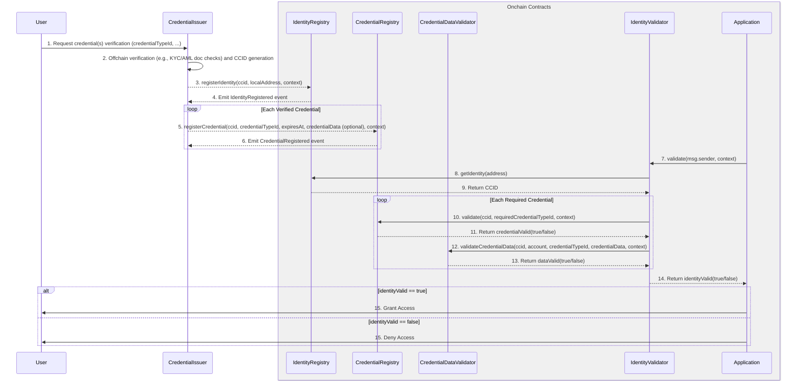

# Credential Issuance and Validation Flow

This document provides a detailed walkthrough of the **complete lifecycle** of issuing and validating credentials within the Cross-Chain Identity framework, highlighting the roles of the **User**, an offchain **Credential Issuer**, and the onchain **Registries**.

## Overview

The credential flow demonstrates how identity verification moves from offchain processes to onchain validation:

- A **Credential Issuer** is an authorized entity (e.g., a service provider) responsible for performing offchain checks and registering credentials onchain
- After a credential is registered, applications can verify it directly by consulting the onchain registries and validator utility contracts
- The Credential Issuer is no longer involved in day-to-day validation checks

## Complete Flow Diagram



## Step-by-Step Breakdown

### 1. **Credential Verification Request**

The **User** requests a specific credential(s) (e.g., `credentialTypeId = common.kyc`) for their account address(es) from a trusted **Credential Issuer**.

**Example**: Alice wants to use a DeFi protocol that requires KYC verification. She contacts an authorized KYC provider.

### 2. **Offchain Verification**

The **Credential Issuer** conducts checks offchain (e.g., KYC/AML document reviews or other advanced verifications).

**What happens**:

- Document verification (passport, driver's license)
- Identity validation against government databases
- AML screening against sanctions lists
- CCID generation for the verified identity

### 3. **Identity Registration**

If valid, the **Credential Issuer** calls `registerIdentity()` on the **Identity Registry** to associate the user's local address(es) with the generated CCID.

```solidity
identityRegistry.registerIdentity(ccid, userAddress, context);
```

### 4. **Identity Confirmation**

The **IdentityRegistry** emits a `IdentityRegistered` event, confirming successful address→CCID registration.

### 5. **Credential Registration**

If valid, the **Credential Issuer** calls `registerCredential()` on the **Credential Registry** to associate the verified credentials with the user's CCID.

```solidity
credentialRegistry.registerCredential(
    ccid,
    keccak256("common.kyc"),
    expirationTimestamp,
    credentialData, // Usually minimal/hashed for privacy
    context
);
```

### 6. **Credential Confirmation**

The **CredentialRegistry** emits a `CredentialRegistered` event, confirming successful credentials issuance.

### 7. **Identity Validation**

When needed, an **Application** calls `validate()` on the **IdentityValidator** to ensure the interacting account is valid and has the required credentials.

```solidity
bool isValid = identityValidator.validate(msg.sender, context);
```

### 8. **Identity Lookup**

The **IdentityValidator** calls `getIdentity()` on the **Identity Registry** to lookup the CCID for the account.

### 9. **CCID Returned**

The **IdentityRegistry** returns the CCID associated with the account.

### 10. **Credential Validation**

The **IdentityValidator** calls `validate()` on the **CredentialRegistry** to confirm the account has the required credential(s).

**Multiple checks may occur**:

- Does the CCID have a `common.kyc` credential?
- Is the credential still valid (not expired)?
- Does it meet minimum validation requirements?

### 11. **Credential Validation Outcome**

The **CredentialRegistry** returns whether the account's credentials are valid.

### 12. **Credential Data Validation** (Optional)

If needed, the **IdentityValidator** calls `validateCredentialData()` on the **CredentialDataValidator** to check the credential data for application-specific requirements.

**Examples**:

- Verify cryptographic proofs
- Check data structure compliance
- Validate credential metadata

### 13. **Data Validation Outcome**

The **CredentialDataValidator** returns whether the credential data is valid.

### 14. **Identity Validation Outcome**

The **IdentityValidator** returns whether the account is valid and contains the required credentials (including ensuring the minimum number of credentials).

### 15. **Access Granted/Denied**

The **Application** informs the **User** of the access decision.

## Key Features Demonstrated

### Multi-Credential Support

This flow checks one or more required credential types, accommodating complex compliance scenarios:

```solidity
// Example: Require both KYC and accredited investor status
bytes32[] memory requiredCredentials = new bytes32[](2);
requiredCredentials[0] = keccak256("common.kyc");
requiredCredentials[1] = keccak256("common.accredited");
```

### Flexible Validation Rules

- **minValidations** allows flexibility (e.g., requiring at least 2 valid KYC credentials from different sources)
- **invert** flag enables negative requirements (e.g., "must NOT be on sanctions list")

### Context-Aware Validation

The `context` parameter enables:

- Cryptographic proofs
- Time-sensitive validation
- Application-specific requirements
- Multi-signature governance approvals

### Privacy Preservation

- Sensitive PII stays offchain with the Credential Issuer
- Only hashes or minimal references stored onchain
- CCID provides identity anchor without revealing personal data

## Security Considerations

For a complete breakdown of security best practices when implementing this system, please see the full **[Security Considerations Guide](./SECURITY.md)**.

## Credential Lifecycle Diagram

This diagram shows the end-to-end flow, from offchain verification to onchain validation.

For practical code examples of how to perform these actions, see the [**API Guide**](./API_GUIDE.md).
