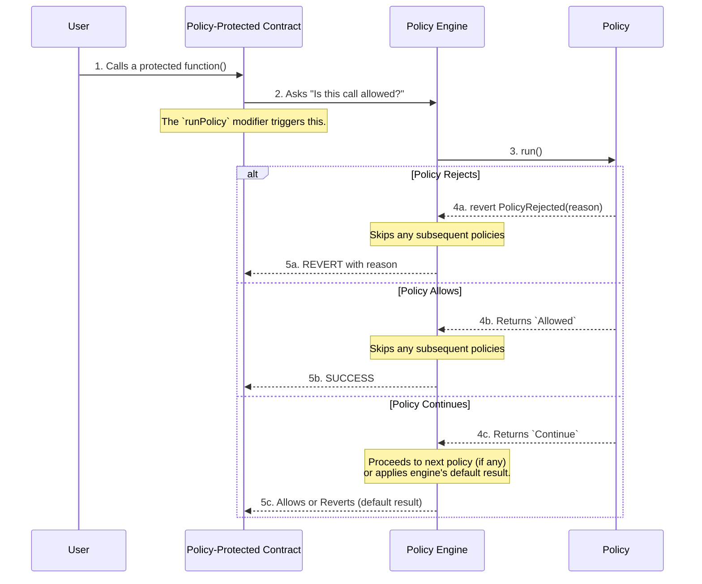

# Policy Management

**A dynamic engine to create and enforce onchain rules. Update compliance logic without redeploying your core contracts.**

## Why This Matters

Hardcoding enforcement logic makes your contracts rigid and difficult to audit. With the Policy Management component, you can separate your application's business logic from its compliance rules, allowing you to adapt to new regulations or security practices on the fly.

A contract might start with simple rules, but as it evolves, more complex logic gets added directly into the function, making it brittle and hard to maintain.

```solidity
// ❌ Before: All rules are hard-coded, making the function complex and inflexible.
contract MyToken {
    address public owner;
    bool public paused;

    function mint(uint256 amount) public {
        require(!paused, "Contract is paused");
        require(msg.sender == owner, "Only owner can mint");
        // ...
    }
}

// ✅ After: The function is only concerned with its core logic.
// All rules (pausable, owner-only, volume limits, etc.) are now separate,
// composable policies attached to the Policy Engine.
import { PolicyProtected } from "@chainlink/policy-management/core/PolicyProtected.sol";

contract MyToken is PolicyProtected {
    function mint(uint256 amount) public runPolicy {
        // ...
    }
}
```

## How It Works: An Overview

Policy Management is built on a few core components that work together to protect your contracts:

- **`PolicyProtected`**: An abstract contract you inherit from. It provides the `runPolicy` modifier that acts as the "hook" into the policy system and includes an optional, advanced **[`context`](docs/CONCEPTS.md#the-context-parameter-a-flexible-data-channel)** for passing arbitrary data like off-chain signatures.
- **`PolicyEngine`**: The central orchestrator. It holds the registry of all policies and executes them in the correct order for any protected function.
- **`Policy`**: A self-contained contract that holds a single rule. It uses a `run()` function for read-only checks and has an optional [`postRun()`](docs/CONCEPTS.md#policy-flow-diagram) function that can modify state _after_ a check has passed.
- **`Extractor`**: A helper contract that parses transaction data for the policies. For most common use cases, the `PolicyEngine` handles the underlying parameter mapping automatically. You can learn more about the [Extractor and Mapper pattern in our Concepts guide](docs/CONCEPTS.md#the-extractor-and-mapper-pattern).

A `Policy` contract's `run()` function can either return a result or revert to reject the transaction:

- **`revert IPolicyEngine.PolicyRejected(reason)`**: Immediately blocks the transaction with a descriptive error message. This is a final "no" that bypasses all subsequent policies and provides clear feedback about why the transaction was rejected.
- **`Allowed`**: Immediately approves the transaction and also bypasses all subsequent policies in the chain. This is a final "yes".
- **`Continue`**: The check passed, but the decision is deferred. The engine proceeds to the next policy in the chain, or applies its default result if none remain.

This diagram illustrates the primary flow: a dApp calls a protected function, and the `PolicyEngine` intercepts the call to check the relevant policies before allowing execution to proceed.



**Important note**: The `PolicyEngine` executes policies **in the order they are added**. For a detailed guide on how to add, remove, and reorder policies, see the **[Policy Ordering Guide](docs/POLICY_ORDERING_GUIDE.md)**. For a more detailed breakdown of the execution flow, see the [Policy Flow Diagram in our Concepts guide](docs/CONCEPTS.md#policy-flow-diagram).

**Key Benefits**:

- **Future-Proof**: Adapt to new regulations or security needs by adding, removing, or updating policies without changing your core contracts.
- **Composable & Reusable**: Chain multiple policies together to create sophisticated rulesets. Reuse the same policies across different contracts and functions.
- **Audit Friendly**: Isolate complex compliance logic into individual policy contracts, making them easier to audit and reason about.
- **Ready-to-Use Library**: Leverage a suite of pre-built, audited policies for common use cases like authorization, volume limits, and more.

## How to Use

The following example shows how to protect a `pause` function so that only a designated Security Administrator can call it. This demonstrates a clear separation of roles, where one address owns the main contract but a different, specialized address is given a specific permission.

### 1. Inherit from `PolicyProtected`

First, make your contract inherit from `PolicyProtected` and add the `runPolicy` modifier to the function you want to secure.

```solidity
import { PolicyProtected } from "@chainlink/policy-management/core/PolicyProtected.sol";

contract MyPausableContract is PolicyProtected {
    bool public paused;

    function pause() public virtual runPolicy {
        paused = true;
    }
}
```

### 2. Deploy and Connect the Components

> **Note:** All Policy Management components must be deployed behind a proxy because they use OpenZeppelin's upgradeable contracts pattern (disabled constructors with initializers). This typically uses `ERC1967Proxy` for upgradeability, though minimal proxies (clones) may be used for immutable components. See the **[Getting Started Guide: Deployment Script](../../getting_started/GETTING_STARTED.md#the-deployment-script)** for the complete proxy deployment pattern.

Once your components are deployed, here are the key configuration steps:

```solidity
// 1. Authorize who can trigger the policy
onlyAuthorizedSenderPolicy.authorizeSender(securityAdmin);

// 2. Register the policy with the engine
policyEngine.addPolicy(
    address(myContract),
    myContract.pause.selector,
    address(onlyAuthorizedSenderPolicy),
    new bytes32[](0)
);
```

These two calls establish the relationship: the `OnlyAuthorizedSenderPolicy` is now enforced on `myContract.pause()`, and only `securityAdmin` can satisfy it. The `contractOwner` cannot call it directly, demonstrating a clear and powerful separation of roles that is difficult to achieve with simple ownership patterns.

This design also makes the contract adaptable to future requirements. For instance, if a new rule dictates that the `pause` function can only be called after a majority of partners have submitted offchain approvals, you wouldn't need to change `MyPausableContract`. You could simply deploy a new `PartnerApprovalPolicy`, and add it to the policy chain for the `pause` selector in the `PolicyEngine`. The `runPolicy` modifier ensures both the original `onlyAuthorizedSenderPolicy` and the new approval policy are checked automatically, without any changes to the core contract.

## Working with Policies

The Policy Management component offers a flexible approach, allowing you to use our library of audited, pre-built policies or to create your own for custom logic.

### Use Our Library of Pre-Built Policies

This component includes a rich library of pre-built, audited policies to accelerate development. These policies cover a wide range of common compliance and access control scenarios.

- **Access Control**: `AllowPolicy`, `BypassPolicy`, `RejectPolicy`, `OnlyOwnerPolicy`, `OnlyAuthorizedSenderPolicy`, `RoleBasedAccessControlPolicy`.
- **Transaction Limits**: `MaxPolicy`, `VolumePolicy`, `VolumeRatePolicy`, `SecureMintPolicy`.
- **Time-Based Rules**: `IntervalPolicy`, `PausePolicy`.

→ **[Explore the Full List and Configuration Guides](./src/policies/README.md)**

### Build Your Own Custom Policies

The true power of the engine comes from its extensibility. You can easily write your own custom policies to enforce any onchain rule imaginable.

- **[Read the Tutorial →](docs/CUSTOM_POLICIES_TUTORIAL.md)** A step-by-step guide to building a policy from scratch.
- **[Get the Boilerplate →](docs/CUSTOM_POLICIES_TUTORIAL.md#boilerplate-template-for-custom-policies)** A clean, commented template to use as a starting point.

## Integration with Other Components

Policy Management is the engine that drives the functionality of the other Chainlink ACE core contracts, allowing you to create powerful, cross-component rules.

### With Cross-Chain Identity

Use identity verification as a dynamic policy condition. The `CredentialRegistryIdentityValidatorPolicy` is a powerful example that checks a user's onchain credentials before allowing an action.

```solidity
// In your deployment script:
CredentialRegistryIdentityValidatorPolicy kycPolicy = new CredentialRegistryIdentityValidatorPolicy();
// ... initialize kycPolicy with your identity validator ...

// Apply the KYC check to the 'transfer' function
policyEngine.addPolicy(
    address(myToken),
    myToken.transfer.selector,
    address(kycPolicy),
    // ... specify parameters ...
);
```

Learn more about [Cross-Chain Identity](../cross-chain-identity/README.md).

## Security Considerations

The Policy Management component is incredibly powerful, but its security depends on correct configuration and management.

- **Policy Management is Critical**: Only authorized roles MUST be able to add, remove, or reorder policies in the `PolicyEngine`. Malicious updates could disable or circumvent all compliance rules.
- **Policy Order Matters**: Policies are executed in the order they are added. A policy that returns `Allowed` will bypass all subsequent policies. Ensure that high-priority checks and restrictive policies are ordered first.
- **Trust in Policies**: A malicious or poorly written policy can introduce vulnerabilities. Only install trusted, audited policies. The `postRun` function, in particular, can modify state and must be treated with extreme caution.
- **External Call Risks**: Policies that make external calls (e.g., to data sources, identity registries, or oracles) can introduce risks like denial of service or gas exhaustion. Since most policy `run()` functions are `view` (read-only), traditional reentrancy attacks are not possible, but **policy administrators** must ensure that external contracts are trusted and reliable when composing policies dynamically.
- **Extractor/Mapper Trust**: The `PolicyEngine` relies on `Extractors` to correctly parse transaction data. If an extractor is compromised or misrepresents data, policies may make decisions based on false information, potentially leading to bypasses.

## Next Steps

- **[Core Concepts](docs/CONCEPTS.md)**: A deep dive into the architecture and design rationale.
- **[Creating Custom Policies](docs/CUSTOM_POLICIES_TUTORIAL.md)**: A step-by-step guide to building your own policies.
  - **[Get the Boilerplate](docs/CUSTOM_POLICIES_TUTORIAL.md#boilerplate-template-for-custom-policies)**: A clean, commented template to use as a starting point.
- **[Policy Ordering Guide](docs/POLICY_ORDERING_GUIDE.md)**: Learn how to add, remove, and reorder policies in the Policy Engine.
- **[API Guide](docs/API_GUIDE.md)**: A developer-focused guide for common tasks.
- **[API Reference](docs/API_REFERENCE.md)**: Complete interface specifications.
- **[Security Deep Dive](docs/SECURITY.md)**: A full checklist of security principles for a robust implementation.
- **[Implementation](./src/) & [Tests](./test/)**: Examine the reference implementation in `/src` and see it in action in the `/test` folder.
