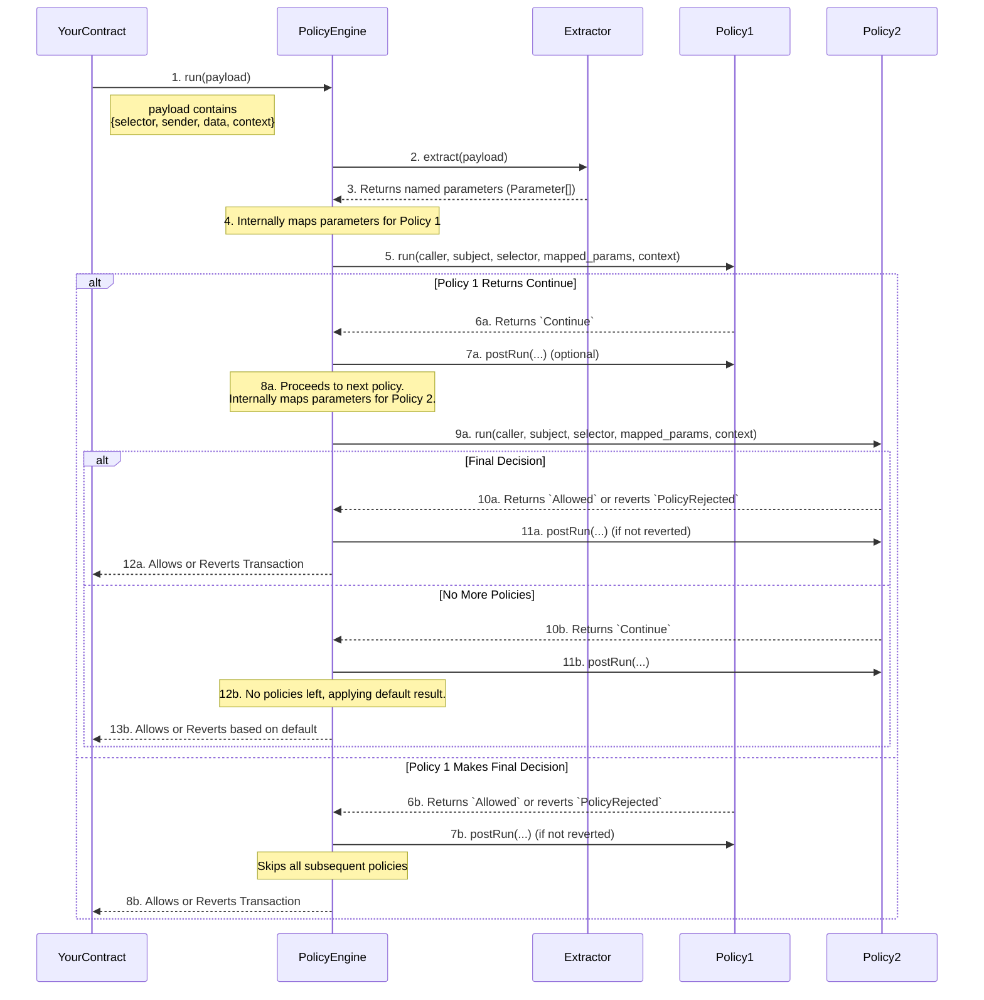

# Core Concepts: Policy Management

## Abstract

The Policy Management component provides a modular framework for defining, executing, and managing dynamic onchain rules. By separating policy logic from core contract logic, this component allows developers to add, remove, and compose compliance and operational rules without redeploying or modifying an application's primary business logic. It provides a robust, extensible, and secure foundation for building adaptable financial applications.

## Glossary of Key Terms

| Term                  | Role                                                                                                                                          |
| --------------------- | --------------------------------------------------------------------------------------------------------------------------------------------- |
| **`PolicyProtected`** | An abstract contract that your application inherits from. It provides the `runPolicy` modifier which acts as the hook into the policy system. |
| **`PolicyEngine`**    | The central onchain orchestrator. It holds the registry of all policies, executes them in order, and manages the default outcome.             |
| **`Policy`**          | A self-contained, modular contract that holds a single, specific rule (e.g., checking a user's role or limiting transaction volume).          |
| **`Extractor`**       | A helper contract that parses raw transaction `calldata` for a specific function signature and decodes it into a list of named parameters.    |
| **`Mapper`**          | An advanced, optional helper contract used to transform or combine parameters from an `Extractor` before they are passed to a `Policy`.       |

## Core Architecture

The Policy Management architecture is designed to be as flexible and decoupled as possible. It is built on a few key components that work in concert to validate transactions.

- **`PolicyProtected`**: The bridge between your application and the compliance engine. By inheriting from this contract and using its `runPolicy` modifier on a function, you designate that function as being subject to the rules managed by the `PolicyEngine`.

- **`PolicyEngine`**: The brain of the system. For any protected function, the engine is responsible for:

  1.  Calling the correct `Extractor` to parse the transaction data.
  2.  Mapping the extracted parameters for each policy (either internally by default, or by delegating to a custom **[`Mapper`](#the-advanced-flow-custom-mappers)**).
  3.  Executing a chain of `Policy` contracts in a defined order.
  4.  Processing the `Allowed`, `Continue` result or `PolicyRejected` revert from each policy.
  5.  Applying a final, default result if no policy returns a definitive `Allowed` or revert.

- **`Policy`**: A modular rule. Each policy is a small, focused contract with a `run()` function that receives parameters and returns a verdict. This is where your specific business or compliance logic lives. The `Policy` can also have an optional `postRun()` function for state changes.

### The Policy Flow: A Step-by-Step Breakdown

The heart of the Policy Management component is the "chain of responsibility" pattern, where a transaction is passed through a series of checks before it is allowed to execute.

#### Policy Flow Diagram

1.  **Diagram Step 1-3 — Invocation and Extraction**  
    The protected contract invokes `PolicyEngine.run(payload)`. The engine calls the designated **Extractor** for the function selector, which decodes the calldata into a full list of named parameters.

2.  **Diagram Step 4-5 — First Policy Execution**  
    The engine's internal mapper prepares the specific parameters required by **`Policy1`**. The engine then calls `Policy1.run(...)`.

3.  **Diagram Step 6-7 — Processing the Result**  
    The diagram now shows two main paths:

    - **Policy 1 makes a final decision (Path 6b):** If `Policy1` returns `Allowed` the engine calls its optional `postRun(...)` function (if not reverted) and the process stops, skipping `Policy2` entirely.
    - **Policy 1 defers (Path 6a):** If `Policy1` returns `Continue`, the engine calls its optional `postRun(...)` function and prepares to execute the next policy in the chain.

4.  **Diagram Step 8-13 — Second Policy Execution**  
    Following Path 6a, the engine now prepares the parameters required by **`Policy2`** and calls its `run` function. The outcome of this second call (or any subsequent policy) will determine the final result, or the engine will use its default if `Policy2` also returns `Continue`.

5.  **Branching Decisions & `postRun`**
    - **reverts `PolicyRejected`**: The policy has found a definitive reason to block the transaction. The `PolicyEngine` immediately reverts the entire transaction. No `postRun` is called.
    - **`Allowed`**: The engine then calls the policy's optional `postRun(...)` function (if implemented), which can be used to perform state changes. The engine then **skips** any remaining policies and allows the transaction.
    - **`Continue`**: The engine calls the policy's optional `postRun(...)` function (if implemented), then moves to the next policy in the chain. If no policies remain, it applies the engine's default outcome.

### The Extractor and Mapper Pattern

A key design principle of the Policy Management component is the separation of concerns between **parsing data** and **enforcing rules**. This is achieved through Extractors and Mappers.

#### The Default Flow (95% of Use Cases)

For most scenarios, the process is simple and powerful:

1.  You write an **Extractor** for a specific function signature (e.g., `ERC20TransferExtractor` for `transfer(address,uint256)`). This extractor is responsible for parsing _all_ the parameters you might need from that function's calldata (e.g., `to` and `value`). You register this one extractor for that function selector using `setExtractor`.

2.  You then attach multiple **Policies** to that same function selector using `addPolicy`. The `PolicyEngine` has a built-in default mapper that works by **name matching**. When you call `addPolicy`, you provide a list of the parameter names that specific policy needs (e.g., `["to"]` for a sanctions policy, `["value"]` for a volume policy).

The engine handles the rest: it calls the single extractor, gets all the parameters, and then for each policy, it provides only the subset of parameters that policy requested by name.

This provides the best of both worlds: efficient data parsing (one extraction per transaction) and clean, decoupled policies.

#### The Advanced Flow (Custom Mappers)

A custom **Mapper** contract (`IMapper`) is only needed for rare, advanced scenarios where simple name-based mapping is not enough. This is for when you need to **transform or combine** extracted data before passing it to a policy.

For example, imagine a policy that needs a `usdValue`, but the extractor only provides `tokenAmount` and `tokenPrice`. You could write a custom mapper that:

1.  Takes `tokenAmount` and `tokenPrice` as input.
2.  Multiplies them to calculate `usdValue`.
3.  Returns the `usdValue` in the `bytes[]` array for the policy.

You would then associate this custom mapper with that specific policy using `setPolicyMapper`, overriding the engine's default behavior for that policy only.

### The `context` Parameter: A Flexible Data Channel

Throughout the Policy Management interfaces, you will see a `bytes calldata context` parameter in functions like `run` and `postRun`. This parameter serves as a powerful, flexible data channel for passing arbitrary, transaction-specific information to your policies.

It is designed for situations where the data needed for a compliance check is **not** part of the protected function's arguments and is provided by the entity that initiates the transaction.

#### Common Use Cases for `context`

- **Offchain Signatures:** A user signs a message offchain (e.g., approving a high-value transaction), and the front-end passes this signature into the `context`. A policy can then decode the signature and use `ecrecover` to validate it.
- **Merkle Proofs:** To verify that an address is part of a large, dynamic allowlist stored offchain, the caller can provide a Merkle proof in the `context`. The policy would then validate this proof against a stored Merkle root.
- **Dynamic Risk Parameters:** An integrator could pass in dynamic, offchain risk scores or session data via the `context`, allowing policies to make more nuanced decisions.

#### How it Works: Two Methods for Passing Context

The `PolicyProtected` contract offers two ways to pass `context` data. The recommended approach is to pass it directly as a function argument, but a two-step method is also available for compatibility with standard interfaces.

1.  **The `...WithContext` Method (Recommended for Custom Functions):**
    For your own custom functions, the cleanest, safest, and most gas-efficient pattern is to pass the context directly as an argument. The `PolicyProtected` contract provides a `runPolicyWithContext(bytes)` modifier for this purpose.

    - **Pros:** Cleaner code, safer (eliminates risk of stale context), more gas-efficient (one transaction).
    - **Cons:** Only works for custom functions where you can define the signature.
    - **Implementation:** The function signature would look like `myFunction(arg1, arg2, bytes calldata context)`, and the modifier would be `runPolicyWithContext(context)`.

2.  **The `setContext` Method (For Standard Interfaces):**
    This method should be used when you need to protect a function with a standard, unchangeable signature (like an ERC20 `transfer`). An external caller first calls `setContext(bytes)` and then immediately calls the protected function in the same transaction. The `runPolicy` modifier automatically retrieves this `context`, includes it in the `Payload`, and clears it after the transaction.

    > **Security Note:** This method stores the context on a per-sender basis. It is **strongly recommended** to set and consume the context in the same atomic transaction to avoid potential race conditions or stale context being reused. **[Learn more about the security implications.](./SECURITY.md#4-context-handling-and-race-conditions)**
